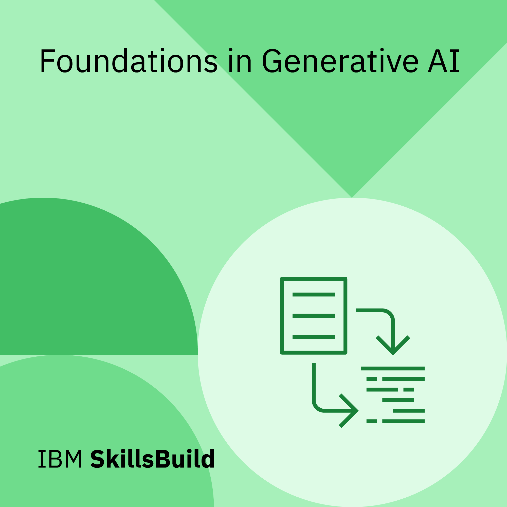

# 📜 Certificates & Credentials

A curated collection of my professional certifications, course completions, and digital badges.

---

## 🐧 Linux Foundation

| Course | Certificate | Verification Code |
|--------|-------------|-------------------|
| **LFC102** — Inclusive Open Source Community Orientation (Aug 2026) | [📄 LFC102.pdf](LFC102.pdf) | `LF-o1g69cbnyd` |
| **LFD102** — A Beginner's Guide to Open Source Software Development (Aug 2026) | [📄 LFD102.pdf](LFD102.pdf) | `LF-uk4zwf9dlf` |

> 🔗 Verify at: [training.linuxfoundation.org/certification/verify](https://training.linuxfoundation.org/certification/verify)

---

## 💼 Virtual Job Simulations — Forage

| Program | Company | Certificate |
|---------|---------|-------------|
| **Data Visualisation: Empowering Business with Effective Insights** | Tata Group | [📄 View Certificate](Tata_Data_Visualisation_Forage.pdf) |
| **GenAI Job Simulation** | Boston Consulting Group (BCG) | [📄 View Certificate](BCG_GenAI_Forage.pdf) |

> 🔗 Verify at: [theforage.com](https://www.theforage.com/)

---

## 🛡️ Cybersecurity

| Certification | Issuer | Certificate | Verification / Details |
|---------------|--------|-------------|------------------------|
| **Cyber Hygiene Practitioner** (Oct 2026) | ISEA / Ministry of Electronics & IT (MeitY) | [📄 View Certificate](ISEA_Cyber_Hygiene_Practitioner.pdf) | Cert No: `CDACHYD/ISEA/CHP/136112` |

> **Description:** Certified in "Cyber Hygiene Practices" as part of the "STAY SAFE ONLINE (SSO) CAMPAIGN" under India's G20 presidency. The campaign is led by the Ministry of Electronics & Information Technology (MeitY), Government of India, and implemented by C-DAC, Hyderabad as part of ISEA Project Phase-II.

---

## 🤖 AI & Machine Learning

### Foundations in Generative AI — IBM SkillsBuild

  

> 🔗 Verify at: [skillsbuild.org](https://skillsbuild.org/)

---

## ☁️ Cloud & CRM

| Platform | Profile |
|----------|---------|
| **Salesforce Trailblazer** | [🔗 View Trailblazer Profile]([https://www.salesforce.com/trailblazer/profile)]https://[(www.salesforce.com/trailblazer/uoht9xfdkmxr3t9txi)]|

---

  <i>Last updated: August 2026</i>

